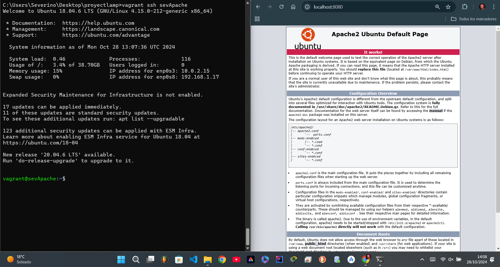

# Pila-Lamp-en-dos-niveles
# Proyecto Vagrant Apache & MySQL

Este proyecto configura dos máquinas virtuales con Vagrant: una con Apache y otra con MySQL. La máquina Apache tiene acceso a Internet, mientras que la máquina MySQL no tiene acceso a la red externa.

## Configuración de las maquinas

- **SeverinoApache**: Servidor Apache, acceso a internet a través de NAT, puerto 8080 mapeado.
- **SeverinoMysql**: Servidor MySQL, sin acceso a internet, red privada.

### Vagrantfile
```ruby
Vagrant.configure("2") do |config|

  # Configuración para la máquina de Apache
  config.vm.define "sevApache" do |apache|
    apache.vm.box = "ubuntu/bionic64"
    apache.vm.hostname = "sevApache"
    apache.vm.network "forwarded_port", guest: 80, host: 8080
    apache.vm.network "public_network"
    apache.vm.provision "shell", path: "apache_provision.sh"
  end

  # Configuración para la máquina de MySQL
  config.vm.define "sevMysql" do |mysql|
    mysql.vm.box = "ubuntu/bionic64"
    mysql.vm.hostname = "sevMysql"
    mysql.vm.network "private_network", ip: "192.168.40.10"
    mysql.vm.provision "shell", path: "mysql_provision.sh"
  end 

# Código del script de aprovisionamiento para Apache aquí

# Código del apache_provision.sh

# Actualiza los paquetes
apt-get update

# Instala Apache
apt-get install -y apache2

# Habilita el servicio de Apache para que inicie automáticamente
systemctl enable apache2

# Inicia el servicio de Apache
systemctl start apache2

# Muestra el estado del servicio
systemctl status apache2

# Código del mysql_provision.sh 

# Actualiza los paquetes
apt-get update

# Instala MySQL
apt-get install -y mysql-server

# Asegúra que el servicio de MySQL esté habilitado
systemctl enable mysql

# Inicia el servicio de MySQL
systemctl start mysql

# Muestra el estado del servicio
systemctl status mysql
```

## Capturas de Pantalla

### Apache en ejecución


### MySQL en ejecución


## Capturas de Pantalla de la conexion entre Vagrant y Github


## Capturas de Pantalla de los dos servicios en funcionamiento


